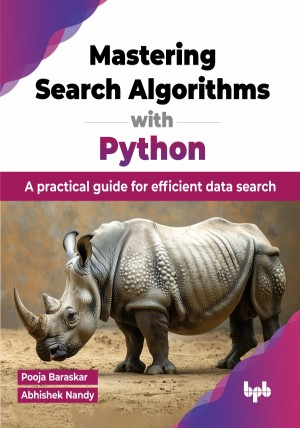

# Mastering Search Algorithms with Python

A practical guide for efficient data search. 

This is the repository for [Mastering Search Algorithms with Python
](https://bpbonline.com/products/mastering-search-algorithms-with-python?variant=43958329868488),published by BPB Publications.

## About the Book
In today's era of Artificial Intelligence and the vast expanse of big data, understanding how to effectively utilize search algorithms has become crucial. Every day, billions of searches happen online, influencing everything from social media recommendations to critical decisions in fields like finance and healthcare. Behind these seemingly straightforward searches are powerful algorithms that determine how information is discovered, organized, and applied, fundamentally shaping our digital interactions. 

This book covers various search algorithms, starting with linear and binary searches, analyzing their performance, and implementing them in Python. It progresses to graph traversal algorithms like DFS and BFS, including Python examples and explores the A* algorithm for optimal pathfinding. Advanced search techniques and optimization best practices are discussed, along with neural network applications like gradient descent. You will also learn to create interactive visualizations using Streamlit and explore real-world applications in gaming, logistics, and Machine Learning.

By the end, readers will have a solid grasp of search algorithms, enabling them to implement them efficiently in Python and tackle complex search problems with ease.

## What You Will Learn
• Understand basic to advanced search algorithms in Python that are crucial for information retrieval.

• Learn different search methods like binary search and A* search, and their pros and cons.

• Use Python’s visualization tools to see algorithms in action for better understanding.

• Enhance learning with practical examples, challenges, and solutions to boost programming skills.
